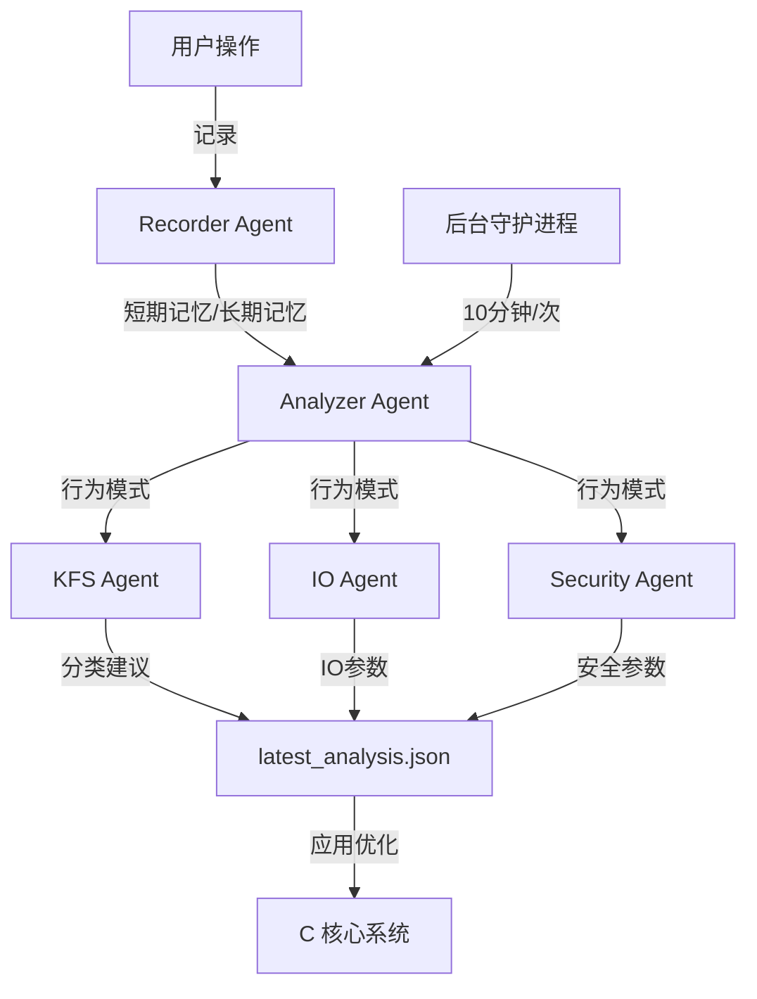

<div align="center">
  
  
  
</div>

<h1 align="center">
  🚀 FILE System - AI 驱动的多智能体文件系统
</h1>

<p align="center">
  <strong>基于 Unix 的模拟文件系统，融入多智能体优化系统，自动学习用户行为并优化系统性能</strong>
</p>

---

## ✨ 核心特性

### 🧠 智能记忆系统
- **短期记忆** - 记录近期操作，超过 48 小时或 100 条自动清理
- **长期记忆** - 保存所有历史操作，学习用户行为模式

### 🤖 多智能体协同
- **Analyzer Agent** - 分析用户行为模式（文字描述）
- **KFS Agent** - 智能文件分类优化
- **IO Agent** - AI 自适应 I/O 优化（预取策略）
- **Security Agent** - 智能行为异常检测与安全阈值优化

### 🔗 C-Python 桥接
- 无缝集成 Python 多智能体系统与 C 核心文件系统
- 优化结果实时应用到系统运行参数

### ⏰ 自动分析
- 登录时立即分析用户行为
- 后台守护进程每 10 分钟自动重新分析

---

## 🏗️ 系统架构



---

## 📁 项目结构

```
fie_system/
├── 📄 docs/                      # 文档
│   ├── 📖 multi_agent_system.md  # 多智能体系统总览
│   └── 🤖 agents/                # 智能体独立文档
│       ├── analyzer_agent.md
│       ├── kfs_agent.md
│       ├── io_agent.md
│       └── security_agent.md
├── 🐍 ai/                        # Python 多智能体系统
│   ├── 🤖 agents/                # 智能体实现
│   │   ├── analyzer_agent.py
│   │   ├── kfs_agent.py
│   │   ├── io_agent.py
│   │   └── security_agent.py
│   ├── 🧠 memory/                # 记忆管理
│   │   └── recorder.py
│   ├── 📋 cli.py                 # 命令行接口
│   ├── 🎼 orchestrator.py        # 智能体编排器
│   ├── ⏱️ daemon.py              # 后台守护进程
│   └── 🔗 glm_client.py          # GLM API 封装
├── 📂 include/                  # 头文件
│   └── filesystem.h
├── 💻 src/                      # C 核心系统
│   ├── core/                     # 核心文件系统
│   │   ├── ai.c                 # C-Python 桥接
│   │   ├── block.c
│   │   ├── directory.c
│   │   ├── disk.c
│   │   ├── file.c
│   │   ├── inode.c
│   │   ├── main.c
│   │   ├── permission.c
│   │   └── user.c
│   └── innovations/             # 创新功能
│       ├── io_optimizer.c
│       ├── kfs.c
│       └── security.c
├── 📝 config.json              # GLM API 配置
└── 🛠️ Makefile / build.bat     # 编译脚本
```

---

## 🔧 快速开始

### 1. 配置 GLM API

创建或编辑 `config.json`：

```json
{
  "glm_api_key": "your_glm_api_key_here",
  "glm_model": "GLM-4"
}
```

### 2. 编译运行

**Windows:**
```bash
build.bat
filesystem.exe
```

**Linux/Mac:**
```bash
make
./filesystem
```

---

## 🎮 使用示例

### 基础操作流程

```bash
# 1. 登录（自动激活多智能体系统）
login
用户名: admin
密码: admin

# 2. 操作文件
create my_file.txt
mkdir my_dir
write my_file.txt Hello World!

# 3. 查看优化建议
suggestions

# 4. 应用优化
optimize

# 5. 手动触发分析
analyze

# 6. 登出
logout
```

### 查看最新分析

使用 `suggestions` 命令查看：

```json
{
  "uid": 0,
  "timestamp": "2024-05-26T14:30:00",
  "behavior_pattern": "用户主要创建文本文件，修改频率中等，删除操作较少...",
  "kfs_suggestion": "建议将 .txt 文件归类为文档...",
  "io_suggestion": "建议预取窗口设为 5...",
  "security_suggestion": "建议删除阈值设为 10...",
  "parameters": {
    "prefetch_window": 5,
    "delete_threshold": 10,
    "modify_threshold": 15
  }
}
```

---

## 📖 详细文档

请查看 `docs/` 目录下的文档：

- [多智能体系统总览](./docs/multi_agent_system.md)
- [Analyzer Agent](./docs/agents/analyzer_agent.md)
- [KFS Agent](./docs/agents/kfs_agent.md)
- [IO Agent](./docs/agents/io_agent.md)
- [Security Agent](./docs/agents/security_agent.md)

---

## 🔑 命令列表

| 命令 | 说明 |
|------|------|
| `login` / `logout` | 用户登录登出 |
| `create <name>` | 创建文件 |
| `delete <name>` | 删除文件 |
| `mkdir <name>` | 创建目录 |
| `rmdir <name>` | 删除目录 |
| `chdir <name>` | 切换目录 |
| `dir` | 列出目录内容 |
| `open <name> <mode>` | 打开文件 |
| `read <fd> <count>` | 读取文件 |
| `write <fd> <data>` | 写入文件 |
| `suggestions` | 查看优化建议 |
| `optimize` | 应用优化参数 |
| `analyze` | 手动触发分析 |
| `help` | 显示帮助 |
| `exit` | 退出系统 |

---

## 📊 记忆存储结构

```
debug_memory/
├── short_term/
│   └── operations.json          # 短期操作（最近 100 条 / 48小时）
└── agent/
    └── memory/
        └── long_term/
            ├── all_operations.json  # 所有历史操作
            ├── learned_params.json  # 学习到的参数
            └── last_analysis.json   # 最新分析结果
```

---

## ⚙️ 配置选项

在 `config.json` 中：

| 配置项 | 说明 | 默认值 |
|--------|------|--------|
| `glm_api_key` | GLM API 密钥 | 必填 |
| `glm_model` | 使用的 GLM 模型 | GLM-4 |

---

## 📝 开发说明

### 运行 Python 脚本直接测试

```bash
# 直接运行命令
python -m ai.cli set_user 0
python -m ai.cli record create test.txt
python -m ai.cli analyze
```

### 后台守护进程

守护进程每 10 分钟自动运行一次分析（当前 C 端启动/停止占位，可完善）

### GUI 图形界面

运行美观的图形界面（推荐使用）：

```bash
python gui.py
```

GUI 功能：
- 🎨 深色主题，美观整洁
- 💾 空间占用可视化（红色=占用，绿色=空闲）
- 📁 文件操作（创建、删除、写入）
- 🤖 AI 优化功能集成
- 📜 实时操作日志

---

## 🤝 贡献

欢迎提交 Issues 和 Pull Requests！

---

## 📄 License

MIT License

---

<p align="center">
  Made with ❤️ and AI
</p>
