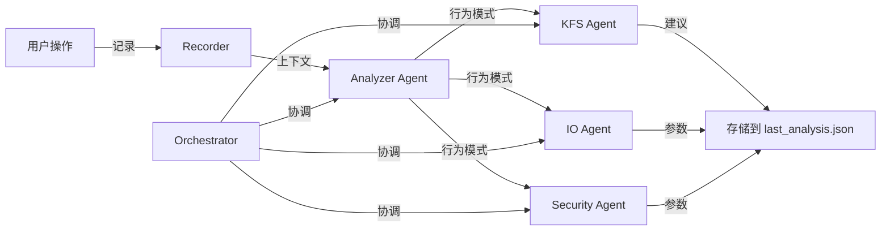

# 🤖 多智能体系统总览

## 📋 概述

FIE System 使用多智能体架构来分析用户行为并优化文件系统性能。系统由四个主要智能体组成，它们协同工作，通过调用 GLM 大模型进行分析。

---

## 🏗️ 智能体架构



---

## 🧩 智能体列表

| 智能体 | 职责 | 输出 | 文档链接 |
|--------|------|------|----------|
| Analyzer Agent | 分析用户行为模式，用自然语言描述 | 文字描述 | [查看](./agents/analyzer_agent.md) |
| KFS Agent | 文件分类优化建议 | 分类建议 | [查看](./agents/kfs_agent.md) |
| IO Agent | I/O 预取策略优化 | 预取窗口参数 | [查看](./agents/io_agent.md) |
| Security Agent | 安全阈值优化 | 删除/修改阈值参数 | [查看](./agents/security_agent.md) |

---

## 🔄 工作流程

### 1. 记忆记录
- 用户每进行一次文件操作，Recorder 都会将其记录到：
  - **短期记忆** - `debug_memory/short_term/operations.json`
  - **长期记忆** - `debug_memory/agent/memory/long_term/all_operations.json`

### 2. 触发分析
分析可以通过以下方式触发：
- 用户登录时自动触发
- 用户输入 `analyze` 命令
- 后台守护进程每 10 分钟自动触发
- 用户输入 `suggestions` 查看时触发

### 3. 分析流程
1. **Orchestrator** 获取当前上下文
2. **Analyzer Agent** 分析行为模式（文字描述）
3. **KFS/IO/Security Agents** 同时参照行为模式进行优化
4. 所有结果存储到 `last_analysis.json`

### 4. 应用优化
用户使用 `optimize` 命令时，系统从 `learned_params.json` 读取参数并应用到 C 端系统。

---

## 📊 上下文数据结构

Orchestrator 传递给各个 Agent 的上下文包含：

```json
{
  "uid": 0,
  "recent_stats": {
    "total_ops": 50,
    "operation_counts": {
      "create": 20,
      "write": 15,
      "delete": 5,
      ...
    },
    "file_types": {
      ".txt": 15,
      ".md": 8,
      ...
    },
    "hours": [9, 10, 14, 15],
    "days": [0, 1, 2, 3, 4]
  },
  "all_stats": {
    /* 长期统计数据 */
  },
  "recent_ops": [/* 最近操作列表 */],
  "historical_ops": [/* 历史操作列表 */]
}
```

---

## 📁 结果存储

### last_analysis.json

```json
{
  "uid": 0,
  "timestamp": "2024-05-26T14:30:00",
  "behavior_pattern": "用户主要在工作日白天操作，以文本文件为主...",
  "kfs_suggestion": "建议将文档文件归类到 /docs 目录...",
  "io_suggestion": "预取窗口建议设为 5...",
  "security_suggestion": "建议删除阈值设为 10...",
  "parameters": {
    "prefetch_window": 5,
    "delete_threshold": 10,
    "modify_threshold": 15
  }
}
```

---

## 🎯 设计理念

### 职责分离
- **Analyzer Agent** 只负责理解和描述行为，不给出具体参数
- **执行 Agent（KFS/IO/Security）** 负责根据行为模式给出具体优化建议和参数

### 并行执行
三个执行 Agent 并行工作，互不依赖，都参照 Analyzer 的结果

---

## 🔌 命令行接口 (CLI)

Python 模块 `ai.cli` 提供 C 端调用的命令：

```bash
# 用户管理
python -m ai.cli set_user 0
python -m ai.cli clear_user

# 记录操作
python -m ai.cli record create test.txt

# 分析
python -m ai.cli analyze

# 获取数据
python -m ai.cli get_optimization
python -m ai.cli get_last_analysis
```

---

## 📝 进一步阅读

- [Analyzer Agent](./agents/analyzer_agent.md)
- [KFS Agent](./agents/kfs_agent.md)
- [IO Agent](./agents/io_agent.md)
- [Security Agent](./agents/security_agent.md)
